# cmdb_ci Business Rules Analysis — PHOENIX DEV

Stand: 23.03.2026 | 22 aktive Rules auf cmdb_ci (Base Table)

## UPDATE Pipeline (Execution Order)

```mermaid
flowchart TD
    subgraph BEFORE["BEFORE UPDATE"]
        direction TB
        B50["<b>50 — FNT Timestamp Check &#x1F534;</b><br/>LWW: fnt_source_timestamp vs sys_updated_on<br/>Rejects stale updates"]
        B100a["100 — SNC CMDB Category<br/>CMDBItem.setCategory()"]
        B100b["100 — Update location &#x26A0;<br/>location = assigned_to.location"]
        B100c["100 — Populate Related Countries &#x1F41E;<br/>Array += String Bug"]
        B500["500 — Validate Duplicate Of CI"]
        B742["742 — Populate CI Manufacturer<br/>manufacturer = model_id.manufacturer"]
        B1000a["1000 — Create asset on model change"]
        B1000b["1000 — Reset Duplicate Discovery Source"]
        B1010["1010 — Reset Unknown Discovery Source"]
        B9000a["9000 — Update lifecycle from legacy &#x26A0;<br/>Legacy → CSDM"]
        B9000b["9000 — Update legacy from CSDM &#x26A0;<br/>CSDM → Legacy"]
        B9900["9900 — Update Asset fields<br/>AssetAndCISynchronizer"]

        B50 --> B100a --> B100b --> B100c --> B500 --> B742 --> B1000a --> B1000b --> B1010 --> B9000a --> B9000b --> B9900
    end

    subgraph AFTER["AFTER UPDATE"]
        direction TB
        A100a["100 — Track Retired CIs<br/>EoL-Ledger bei life_cycle_stage change"]
        A100b["100 — cmdb synch event<br/>relationship.rollup"]
        A200["<b>200 — FNT Outbound Sync &#x1F534;</b><br/>Delta-Payload an FNT pushen"]
        A500["500 — Update model category"]
        A1000["1000 — Move duplicates of CI"]

        A100a --> A100b --> A200 --> A500 --> A1000
    end

    subgraph ASYNC["ASYNC UPDATE"]
        direction TB
        AS100a["100 — CSDM Data Sync<br/>managed_by_group bei Reklassifizierung"]
        AS100b["100 — Outside Maintenance Schedule<br/>Change Request pruefen"]
        AS100c["100 — Adjust plan records"]

        AS100a --> AS100b --> AS100c
    end

    BEFORE --> AFTER --> ASYNC

    style B50 fill:#3d1215,stroke:#f85149,stroke-width:3px,color:#f8d7da
    style A200 fill:#3d1215,stroke:#f85149,stroke-width:3px,color:#f8d7da
    style B100b fill:#2d1f0f,stroke:#d29922,color:#ffeeba
    style B100c fill:#2d0f0f,stroke:#f85149,stroke-dasharray:5 5,color:#f8d7da
    style B9000a fill:#2d1f0f,stroke:#d29922,color:#ffeeba
    style B9000b fill:#2d1f0f,stroke:#d29922,color:#ffeeba
```

## INSERT Pipeline (Execution Order)

```mermaid
flowchart TD
    subgraph BEFORE["BEFORE INSERT"]
        direction TB
        I10["<b>10 — FNT Idempotency Check &#x1F534;</b><br/>X-Idempotency-Key → Duplikat-Schutz"]
        I100a["100 — Null out asset"]
        I100b["100 — SNC CMDB Category"]
        I100c["100 — Update location &#x26A0;"]
        I100d["100 — Populate Related Countries"]
        I500["500 — Validate Duplicate Of CI"]
        I742["742 — Populate CI Manufacturer"]
        I9000a["9000 — Lifecycle from legacy"]
        I9000b["9000 — Lifecycle from CSDM"]
        I9900["9900 — Create Asset on insert"]

        I10 --> I100a --> I100b --> I100c --> I100d --> I500 --> I742 --> I9000a --> I9000b --> I9900
    end

    subgraph AFTER["AFTER INSERT"]
        direction TB
        IA100["100 — cmdb synch event<br/>relationship.rollup"]
        IA500["500 — Update model category"]
        IA1000["1000 — Move duplicates of CI"]

        IA100 --> IA500 --> IA1000
    end

    BEFORE --> AFTER

    style I10 fill:#3d1215,stroke:#f85149,stroke-width:3px,color:#f8d7da
    style I100c fill:#2d1f0f,stroke:#d29922,color:#ffeeba
```

## Datenfluss ueber CI-Relationen

```mermaid
flowchart LR
    subgraph FNT_RELATIONS["FNT Integration (Phase 1)"]
        RACK["&#x1F4E6; Rack<br/>cmdb_ci_rack"]
        SERVER["&#x1F5A5; Server<br/>cmdb_ci_server"]
        CHASSIS["&#x1F4E6; Chassis<br/>cmdb_ci_chassis_server"]
        BLADE["&#x1F5A5; Blade Server<br/>cmdb_ci_server"]

        RACK -->|"Contains"| SERVER
        RACK -->|"Contains"| CHASSIS
        CHASSIS -->|"Runs on"| BLADE
    end

    subgraph PROPAGATION["Daten-Propagation (bestehend)"]
        APP["&#x1F4F1; Application<br/>cmdb_ci_appl"]
        WINSRV["&#x1F5A5; Windows Server<br/>cmdb_ci_win_server"]
        APP2["&#x1F4F1; Other Apps"]

        APP -->|"cmdb_rel_ci<br/>parent→child"| WINSRV
        WINSRV -->|"cmdb_rel_ci<br/>child→parent"| APP2
    end

    subgraph EVENTS["Events bei CI-Update"]
        ROLLUP["&#x1F504; relationship.rollup<br/>Jedes CI-Update feuert diesen Event"]
        EOL["&#x26D4; DependentCIHelper<br/>Prueft abhaengige CIs bei Retire"]
        GXP["&#x2695; GxP Relevance<br/>Propagiert u_gxp_relevance"]
    end

    SERVER -.->|"Update triggert"| ROLLUP
    APP -.->|"Insert/Update"| GXP
    GXP -.->|"setzt u_gxp_relevance"| WINSRV
    ROLLUP -.->|"bei life_cycle_stage=EoL"| EOL

    style RACK fill:#1a2332,stroke:#79c0ff,color:#c9d1d9
    style SERVER fill:#1a2332,stroke:#79c0ff,color:#c9d1d9
    style CHASSIS fill:#1a2332,stroke:#79c0ff,color:#c9d1d9
    style BLADE fill:#1a2332,stroke:#79c0ff,color:#c9d1d9
    style APP fill:#1a2d1a,stroke:#7ee787,color:#c9d1d9
    style WINSRV fill:#1a2d1a,stroke:#7ee787,color:#c9d1d9
    style APP2 fill:#1a2d1a,stroke:#7ee787,color:#c9d1d9
    style ROLLUP fill:#2d1f1a,stroke:#ffa657,color:#c9d1d9
    style EOL fill:#2d1f1a,stroke:#ffa657,color:#c9d1d9
    style GXP fill:#2d0f0f,stroke:#f85149,stroke-dasharray:5 5,color:#c9d1d9
```

## Erkannte Probleme

```mermaid
flowchart TD
    subgraph ISSUES["&#x26A0; Erkannte Probleme"]
        direction TB
        P1["&#x1F41E; <b>Populate Related Countries</b><br/>Array += String Konkatenation<br/>Trailing Komma in u_related_countries"]
        P2["&#x26A0; <b>Update location</b><br/>Ueberschreibt location bei jedem<br/>INSERT/UPDATE unkontrolliert"]
        P3["&#x26A0; <b>Lifecycle Sync Loop-Risiko</b><br/>2 Rules bei Order 9000 syncen<br/>bidirektional Legacy ↔ CSDM"]
        P4["&#x1F41E; <b>GxP Relevance Debug-Code</b><br/>gs.log TEST MS 1 Statements<br/>in Production"]
        P5["&#x1F6AB; <b>Leere Business Rules</b><br/>2 Rules mit leerem Script-Body<br/>auf cmdb_ci_business_app"]
    end

    subgraph FNT_IMPACT["Auswirkung auf FNT Integration"]
        direction TB
        F1["&#x2705; u_fnt_campus/gebaeude sind<br/>separate Felder → kein Konflikt<br/>mit location-Rule"]
        F2["&#x26A0; FNT Retire setzt life_cycle_stage<br/>→ triggert BEIDE Lifecycle Rules<br/>→ Timestamp Check Order 50 ist korrekt"]
        F3["&#x2705; relationship.rollup wird bei<br/>jedem FNT-Update gefeuert<br/>→ gewuenschtes Verhalten"]
    end

    P2 --> F1
    P3 --> F2

    style P1 fill:#2d0f0f,stroke:#f85149,color:#f8d7da
    style P2 fill:#2d1f0f,stroke:#d29922,color:#ffeeba
    style P3 fill:#2d1f0f,stroke:#d29922,color:#ffeeba
    style P4 fill:#2d0f0f,stroke:#f85149,stroke-dasharray:5 5,color:#f8d7da
    style P5 fill:#1a1a2e,stroke:#484f58,color:#8b949e
    style F1 fill:#0f2d0f,stroke:#7ee787,color:#c9d1d9
    style F2 fill:#2d1f0f,stroke:#d29922,color:#ffeeba
    style F3 fill:#0f2d0f,stroke:#7ee787,color:#c9d1d9
```

